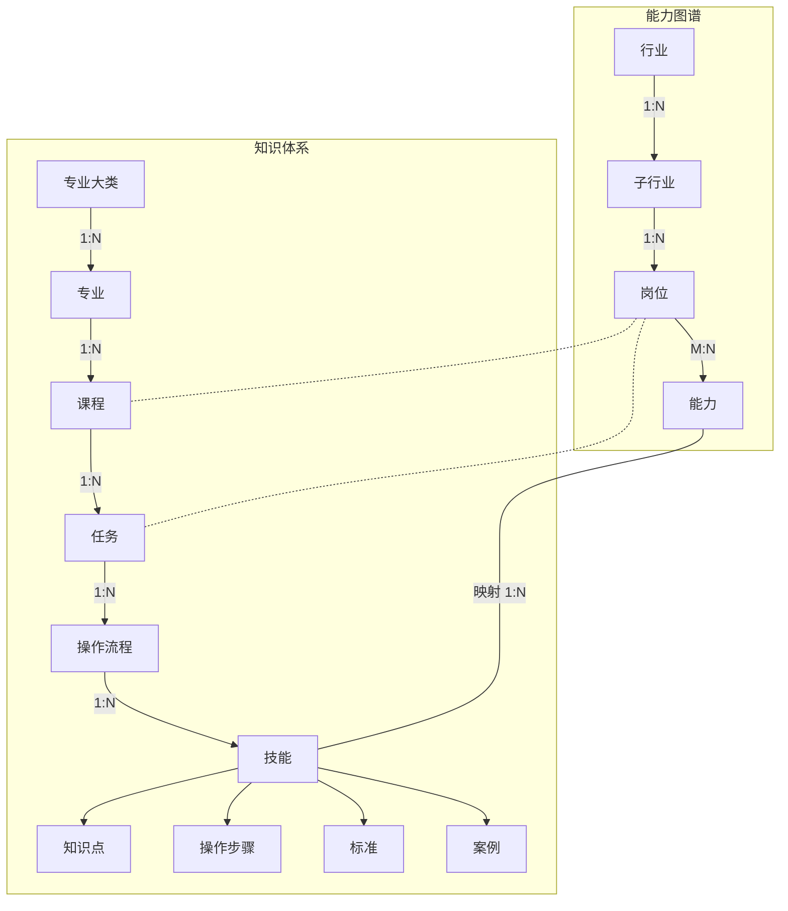

# 双图谱结构说明

本文用文字描述「能力图谱 × 知识体系」双图谱的结构，内容与原结构图一一对应。涉及节点层级、节点关系、跨图谱连接时，以本文为准。

---

## 1. 两张图谱

| 图谱 | 作用 | 节点层级（从上到下） |
|---|---|---|
| **能力图谱**（行业侧） | 描述行业对岗位能力的要求 | 行业 → 子行业 → 岗位 → 能力 |
| **知识体系**（教学侧） | 描述专业的教学内容 | 专业大类 → 专业 → 课程 → 任务 → 操作流程 → 技能 → 知识点 / 操作步骤 / 标准 / 案例 |

---

## 2. 能力图谱内部关系

| 上级 | 下级 | 基数 | 说明 |
|---|---|---|---|
| 行业 | 子行业 | 1:N | 一个行业下有多个子行业 |
| 子行业 | 岗位 | 1:N | 一个子行业下有多个岗位 |
| 岗位 | 能力 | **M:N** | 一个岗位要求多个能力；同一个能力可被多个岗位要求 |

注意：岗位和能力之间是多对多关系，不是树。展示时，能力去重，由多个岗位分别连线过来。

---

## 3. 知识体系内部关系

| 上级 | 下级 | 基数 | 说明 |
|---|---|---|---|
| 专业大类 | 专业 | 1:N | |
| 专业 | 课程 | 1:N | |
| 课程 | 任务 | 1:N | |
| 任务 | 操作流程 | 1:N | |
| 操作流程 | 技能 | 1:N | |
| 技能 | 知识点 | 1:N | 技能下的四类末端节点 |
| 技能 | 操作步骤 | 1:N | 同上 |
| 技能 | 标准 | 1:N | 同上（页面上也称「规范」） |
| 技能 | 案例 | 1:N | 同上 |

要点：
- 知识点、操作步骤、标准、案例这四类节点**都挂在技能下**，彼此平级。
- 「专业大类」是专业的上一级，按此结构是知识体系的最顶层。

---

## 4. 跨图谱连接

| 能力图谱侧 | 知识体系侧 | 线型 | 标注 | 含义 |
|---|---|---|---|---|
| 能力 | 技能 | 实线 | 映射 1:N | **两张图谱唯一的直接连接**：一个能力由多个技能支撑 |
| 岗位 | 课程 | 虚线 | 无 | 岗位与课程之间的关联 |
| 岗位 | 任务 | 虚线 | 无 | 岗位与任务之间的关联 |

关于两条虚线：原图没有标基数，也没有图例说明含义。结合实线只有「能力—技能」一条，建议按**间接关联**理解：它们不是独立存储的关系，而是沿「岗位 → 能力 → 映射 → 技能 → 操作流程 → 任务 → 课程」推导出来的。如果实际数据或实现和这个理解不一致，先指出来再动手，不要自行决定。

---

## 5. 图中没有画出、但页面用到的关系

| 关系 | 现状 | 处理 |
|---|---|---|
| 专业 — 岗位（对口） | 原图没有画这条线；项目里有专业—岗位对口表（`data_pano_tree.py`），「全景图谱·」的能力树（行业 › 专业 › 岗位 › 能力）依赖这张表 | 按已确认数据使用；它属于跨图谱的业务数据，不属于上面任何一张图谱的内部层级 |
| 行业 — 专业大类 / 专业 | 原图没有连接 | 两张图谱在行业和专业这一层不直接相连 |

---

## 6. 与当前数据的差异（改代码前先核对）

原图是目标结构，当前数据可能还没完全按它组织。遇到下面这些情况，先回报现状，不要自行调整数据：

1. **操作步骤的位置**：原图中操作步骤挂在**技能**下；当前数据里操作步骤可能挂在操作流程下。
2. **知识点、标准、案例的位置**：原图中挂在技能下；当前数据里可能挂在操作流程、步骤、任务或模块下。
3. **模块层**：原图没有「模块」；当前数据里课程和任务之间可能有模块层。展示归属链时跳过模块。
4. **专业大类**：原图有这一层；当前数据里可能还没有。
5. **缺层的情况**：部分课程类型（如理论认知类、职业素养类）的任务下没有操作流程，这时技能直接挂在任务下，展示时跳过流程层。

---

## 7. 结构图（Mermaid）

